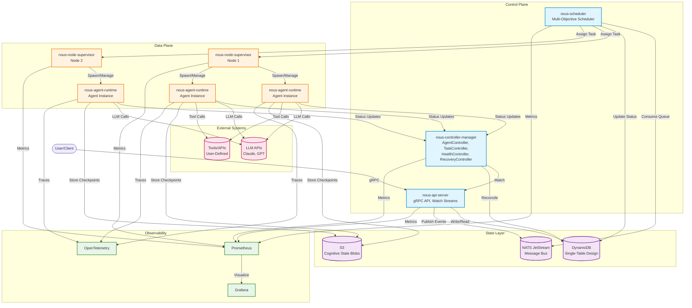

# System Architecture

## Overview

Nous is a standalone AI agent orchestration system that applies Kubernetes-style infrastructure patterns (declarative resources, reconciliation loops, self-healing) to AI agent management. It is NOT a Kubernetes operator — it is runtime-agnostic and manages agents across ECS, Lambda, VMs, and edge devices.

**Critical Design Insight**: Container orchestration patterns don't map 1:1 to cognitive workloads. Agents are probabilistic (not deterministic), have complex cognitive state (not externalized state), require semantic health evaluation (not binary checks), and need multi-objective resource scheduling (not simple bin packing).

---

## Architecture Style

**Pattern**: Control Plane / Data Plane Split (Kubernetes-inspired)

---

## Nous Resources vs Kubernetes Analogy

| Nous Resource | Kubernetes Analog | Purpose |
|---------------|-------------------|---------|
| **AgentDefinition** | Deployment | Declares desired state of an agent type (model, tools, scaling policy) |
| **AgentTask** | Job | Unit of work to be executed by an agent |
| **AgentInstance** | Pod | Running instance of an agent (managed by controller, not user) |
| **Namespace** | Namespace | Multi-tenancy isolation boundary |
| **Controller** | Controller | Reconciliation loop aligning actual state with desired state |
| **Scheduler** | kube-scheduler | Matches tasks to nodes based on capacity and constraints |

---

## How Agents Differ from Containers

| Aspect | Containers (Kubernetes) | Agents (Nous) |
|--------|-------------------------|---------------|
| **Determinism** | Deterministic (same input → same output) | Probabilistic (LLM non-determinism) |
| **State** | Externalized state (ConfigMaps, Secrets) | Complex cognitive state (context window, reasoning history) |
| **Health Checks** | Binary (alive/dead via TCP/HTTP probe) | Semantic (quality score, cost ceiling, reasoning coherence) |
| **Scheduling** | Simple bin packing (CPU, memory, GPU) | Multi-objective (cost, quality, latency trade-offs) |
| **Failure Recovery** | Restart container | Checkpoint restoration, reasoning state recovery |
| **Scaling Metric** | Resource utilization (CPU, memory) | Queue depth, quality threshold, cost budget |

---

## Component Descriptions

### Control Plane

#### nous-api-server
- **Role**: User entrypoint for the Nous platform
- **Responsibilities**:
  - gRPC API server implementing `NousAPI` service
  - CRUD operations for AgentDefinitions and AgentTasks
  - Watch streams for controllers (server-side streaming gRPC)
  - Resource validation and admission control
  - Optimistic concurrency via `resource_version` (ULIDs)
- **Storage**: DynamoDB (via StateStore interface)
- **Phase**: Phase 1

#### nous-scheduler
- **Role**: Multi-objective task-to-node matching
- **Responsibilities**:
  - Consume task queue from NATS
  - Evaluate nodes based on capacity, affinity rules, cost constraints
  - Assign tasks to nodes using multi-objective optimization
  - Update task status (Pending → Scheduled)
- **Scheduling Criteria**:
  - Task priority (Critical > High > Medium > Low)
  - Node capacity (available CPU, memory, tokens/min)
  - Agent selector matching (task → agent definition)
  - Affinity/anti-affinity rules
- **Phase**: Phase 2

#### nous-controller-manager
- **Role**: Reconciliation controllers ensuring desired state alignment
- **Responsibilities**:
  - **AgentController**: Reconcile AgentDefinition → AgentInstances (scale up/down)
  - **TaskController**: Monitor task timeouts, retries
  - **HealthController**: Evaluate agent health (quality score, cost, error rate)
  - **RecoveryController**: Handle agent failures (restart, replace, checkpoint restoration)
- **Leader Election**: DynamoDB lease with fencing tokens
- **Phase**: Phase 1

---

### Data Plane

#### nous-node-supervisor
- **Role**: Per-node daemon managing agent runtime processes
- **Responsibilities**:
  - Spawn/terminate `nous-agent-runtime` processes
  - Report node capacity to control plane
  - Health checks on local agents
  - Process isolation and resource limits enforcement
- **Phase**: Phase 2

#### nous-agent-runtime
- **Role**: Sandboxed agent execution environment
- **Responsibilities**:
  - Execute agent tasks (LLM calls, tool invocations)
  - Manage conversation context and cognitive state
  - Checkpoint reasoning state to S3
  - Report task metrics (tokens, cost, quality, latency)
  - Publish status updates to controllers
- **Phase**: Phase 2

---

### State Layer

#### DynamoDB
- **Role**: Primary state store for all Nous resources
- **Design**: Single-table design with composite keys (PK/SK)
- **Features**:
  - Optimistic concurrency via conditional writes
  - DynamoDB Streams for Watch API (Phase 2)
  - TTL for lease expiration
  - GSIs for listing and filtering
- **Phase**: Phase 1

#### S3
- **Role**: Blob storage for cognitive state
- **Use Cases**:
  - Conversation history (large, grows over time)
  - Checkpoints (reasoning state snapshots)
  - Result artifacts (large outputs)
- **Phase**: Phase 1

#### NATS JetStream
- **Role**: Durable message bus for inter-service communication
- **Use Cases**:
  - Task queue (Scheduler consumes)
  - Watch events (multi-instance API servers, Phase 2)
  - Inter-agent messaging (Phase 3)
- **Phase**: Phase 2

---

## Technology Stack

| Component | Technology | Purpose |
|-----------|-----------|---------|
| **Language** | Go 1.22+ | All control plane and data plane services |
| **Proto** | Protobuf v3 + Buf | Service contracts and type definitions |
| **State Store** | DynamoDB | Primary state storage (pluggable via interface) |
| **Blob Store** | S3 | Cognitive state, checkpoints, large artifacts |
| **Messaging** | NATS JetStream | Task queue, Watch events, inter-agent comms |
| **Infrastructure** | Pulumi (TypeScript) | AWS deployment automation |
| **Observability** | Prometheus + OpenTelemetry + Grafana | Metrics, traces, dashboards |
| **CI/CD** | GitHub Actions | Build, test, deploy pipelines |
| **Container Runtime** | ECS (AWS Fargate) | Serverless container orchestration |
| **Local Dev** | Docker Compose + DynamoDB Local | Development environment |

---

## Deployment Architecture

### Development
- **Platform**: kind/k3s (local Kubernetes) OR docker-compose
- **State**: DynamoDB Local
- **Storage**: LocalStack S3
- **Messaging**: NATS container

### Staging
- **Platform**: Single-AZ EKS (AWS)
- **State**: DynamoDB on-demand
- **Storage**: S3
- **Messaging**: NATS JetStream on ECS

### Production
- **Platform**: Multi-AZ EKS (AWS)
- **State**: DynamoDB provisioned capacity
- **Storage**: S3 with lifecycle policies
- **Messaging**: NATS JetStream on ECS (HA cluster)
- **Observability**: Prometheus + Grafana + CloudWatch

---

## State Management Model

Nous uses a **three-dimensional state model**:

### 1. Infrastructure State
- Agent instance phase (Pending, Starting, Ready, Running, Terminating, Failed)
- Node capacity (CPU, memory, tokens/minute)
- Task phase (Pending, Scheduled, Running, Succeeded, Failed)

### 2. Cognitive State
- Conversation context (LLM message history)
- Reasoning depth (how many reasoning steps)
- Context utilization (percentage of context window filled)
- Active tasks count

### 3. Behavioral State
- Task metrics (tokens, cost, latency, quality)
- Health indicators (error rate, success rate, quality floor violations)
- Instance metrics (tasks completed, avg quality, total cost)

**Storage**:
- Infrastructure state → DynamoDB (fast access, indexed queries)
- Cognitive state → S3 (large blobs, infrequent reads)
- Behavioral metrics → Prometheus (time-series, aggregations)

---

## Multi-Tenancy

**Isolation Mechanism**: Kubernetes-style namespaces

- Each team/project gets a dedicated namespace
- Resources scoped to namespace (e.g., `NS#production#AGENTDEF#researcher`)
- Cross-namespace references prohibited
- Namespace-level resource quotas (future)

**Default Namespaces**:
- `default` — User workloads
- `nous-system` — Platform components (reserved)

---

## Communication Patterns

### Synchronous (gRPC)
- User → API Server (CRUD operations)
- Controller → API Server (Watch streams)
- Scheduler → Node Supervisor (task assignment)

### Asynchronous (NATS)
- API Server → Scheduler (task submission via queue)
- Agent Runtime → Controller (status updates via pub/sub)
- Watch events (Phase 2, multi-instance API servers)

### Storage-Mediated
- All services → DynamoDB (read/write state)
- Agent Runtime → S3 (write checkpoints, read on recovery)

---

## Observability

### Metrics (Prometheus)
- `nous_grpc_request_duration_seconds` — Request latency
- `nous_reconciliation_duration_seconds` — Controller performance
- `nous_agent_instances_total{definition, phase}` — Agent inventory
- `nous_task_duration_seconds{priority}` — Task execution time
- `nous_llm_api_cost_dollars_total{provider, model}` — LLM cost tracking

### Tracing (OpenTelemetry)
- Full request tracing: User → API → Scheduler → Node → Agent → LLM
- Distributed context propagation
- Span attributes: task_id, agent_id, model, cost

### Logging (Structured)
- `slog` (Go 1.21+ stdlib)
- JSON format in production
- Fields: timestamp, level, component, task_id, agent_id, message

---

## Security

### Secrets Management
- LLM API keys → AWS Secrets Manager
- Auto-rotation via Lambda
- Injected as environment variables

### IAM Roles
- ECS tasks use IAM roles (no API keys)
- Least-privilege policies per service
- S3 bucket policies enforce encryption

### Multi-Tenancy Isolation
- Namespace-scoped access (future: RBAC)
- Network policies between namespaces

---

## References

- [CLAUDE.md](../CLAUDE.md) — Master implementation prompt
- [dependency-graph.md](./dependency-graph.md) — Inter-repo relationships
- [data-model.md](./data-model.md) — DynamoDB schema
- [ADR-001](../adr/001-standalone-control-plane.md) — Standalone control plane decision
