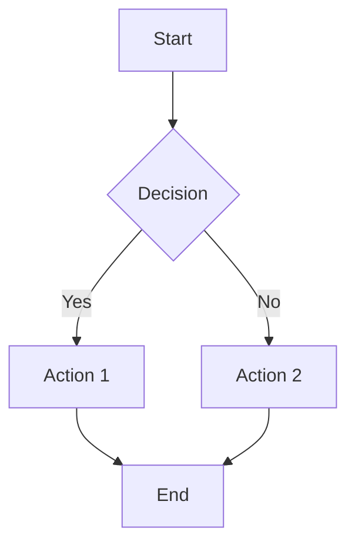
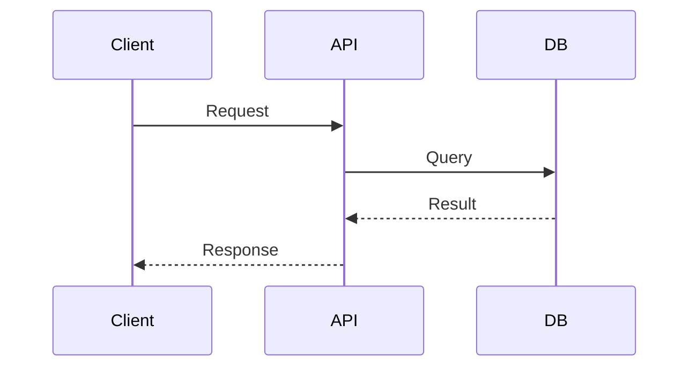
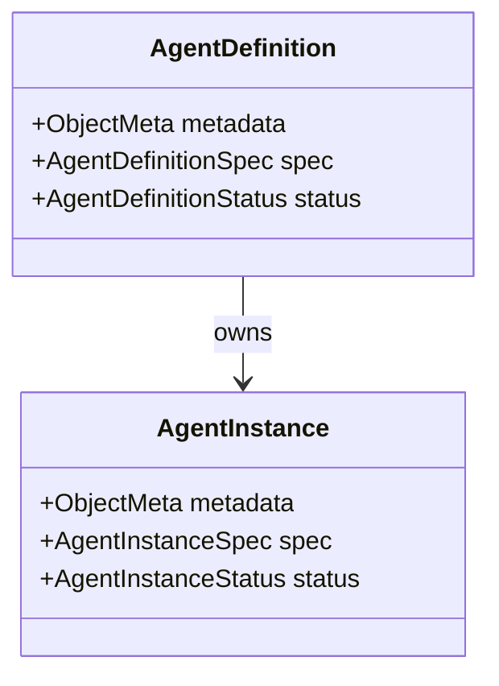
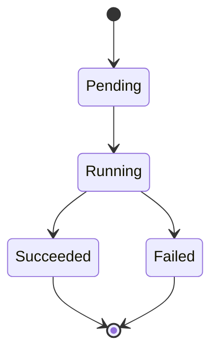
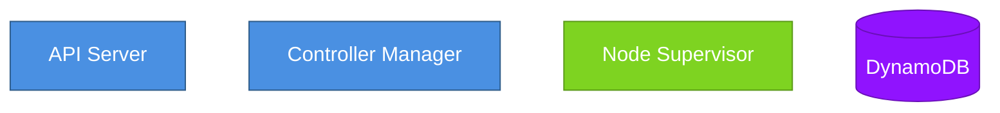
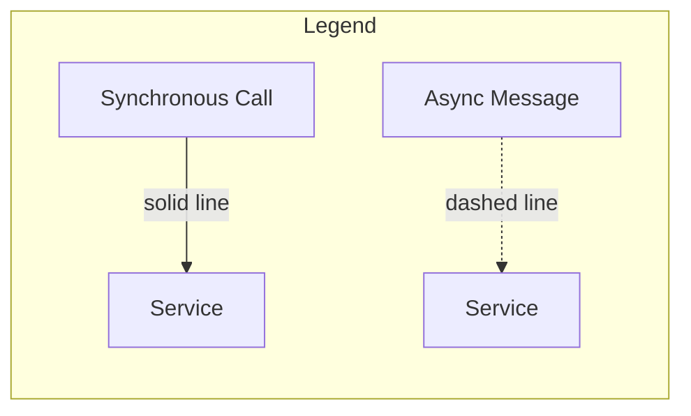

# Diagrams

This directory contains Mermaid diagrams embedded in the architecture documentation. Mermaid is a text-based diagramming language that renders to visual diagrams in supported viewers.

---

## Viewing Diagrams

### GitHub / GitLab

All Mermaid diagrams in this repository render automatically when viewing Markdown files on GitHub or GitLab. No additional setup required.

### VS Code

Install the [Markdown Preview Mermaid Support](https://marketplace.visualstudio.com/items?itemName=bierner.markdown-mermaid) extension:

```bash
code --install-extension bierner.markdown-mermaid
```

After installation, open any Markdown file with Mermaid diagrams and use the preview pane (`Cmd+Shift+V` on macOS, `Ctrl+Shift+V` on Windows/Linux).

### JetBrains IDEs (IntelliJ, GoLand, etc.)

Mermaid support is built-in for JetBrains IDEs 2021.1+. Open any Markdown file with Mermaid diagrams and use the preview pane.

### CLI Rendering (mermaid-cli)

Install the Mermaid CLI tool to render diagrams to PNG/SVG:

```bash
npm install -g @mermaid-js/mermaid-cli
```

Render a diagram from a standalone `.mmd` file:

```bash
mmdc -i diagram.mmd -o diagram.png
```

Extract and render a Mermaid block from Markdown:

```bash
# Extract the Mermaid code block from a Markdown file
sed -n '/```mermaid/,/```/p' system-architecture.md | sed '1d;$d' > temp.mmd

# Render to PNG
mmdc -i temp.mmd -o system-architecture.png

# Clean up
rm temp.mmd
```

### Online Viewer

Paste Mermaid code into the [Mermaid Live Editor](https://mermaid.live/) for instant rendering and export options.

---

## Diagram Locations

All Mermaid diagrams are embedded within architecture documentation files, not stored as separate diagram files. This keeps diagrams co-located with the documentation they illustrate.

### System Architecture

**File**: [`architecture/system-architecture.md`](../architecture/system-architecture.md)

**Diagrams**:
- High-level system architecture (Control Plane / Data Plane)

### Dependency Graph

**File**: [`architecture/dependency-graph.md`](../architecture/dependency-graph.md)

**Diagrams**:
- Inter-repository dependency graph (DAG structure)

---

## Mermaid Syntax Reference

### Graph/Flowchart



### Sequence Diagram



### Class Diagram



### State Diagram



---

## Diagram Style Guidelines

Follow these conventions when creating or updating diagrams:

### 1. Use Consistent Naming

- **Services**: CamelCase (e.g., `APIServer`, `ControllerManager`)
- **Resources**: CamelCase (e.g., `AgentDefinition`, `AgentTask`)
- **Actions**: Verb phrases (e.g., "Create AgentDefinition", "Reconcile State")

### 2. Color Coding (when using styling)

- **Control Plane**: Blue (`#4A90E2`)
- **Data Plane**: Green (`#7ED321`)
- **External Systems**: Orange (`#F5A623`)
- **Storage**: Purple (`#9013FE`)

Example with styling:



### 3. Keep Diagrams Focused

- One primary concept per diagram
- Limit to 10-15 nodes for readability
- Break complex systems into multiple diagrams

### 4. Include Legends

For complex diagrams, include a legend explaining symbols and colors:



---

## Regenerating All Diagrams

To regenerate all diagrams from Markdown files (useful for CI/CD documentation builds):

```bash
#!/bin/bash
# scripts/render-diagrams.sh

DOCS_DIR="$(dirname "$0")/../"

find "$DOCS_DIR" -name "*.md" -print0 | while IFS= read -r -d '' file; do
    filename=$(basename "$file" .md)
    dirname=$(dirname "$file")

    # Extract Mermaid blocks and render each one
    awk '/```mermaid/,/```/' "$file" | \
        sed '/```/d' | \
        mmdc -i - -o "${dirname}/${filename}-diagram.png"
done
```

**Note**: This script requires `mermaid-cli` installed globally.

---

## Contributing

When adding or updating diagrams:

1. **Embed in Markdown**: Place Mermaid code blocks directly in documentation, not as separate `.mmd` files
2. **Test rendering**: Verify diagrams render correctly on GitHub preview before committing
3. **Follow style guide**: Use consistent naming and color conventions
4. **Keep it simple**: Prefer clarity over completeness; break complex diagrams into multiple views

---

## Resources

- [Mermaid Documentation](https://mermaid.js.org/)
- [Mermaid Live Editor](https://mermaid.live/)
- [Mermaid Syntax Reference](https://mermaid.js.org/intro/syntax-reference.html)
- [GitHub Mermaid Support](https://github.blog/2022-02-14-include-diagrams-markdown-files-mermaid/)

---

**Last Updated**: 2026-02-15
