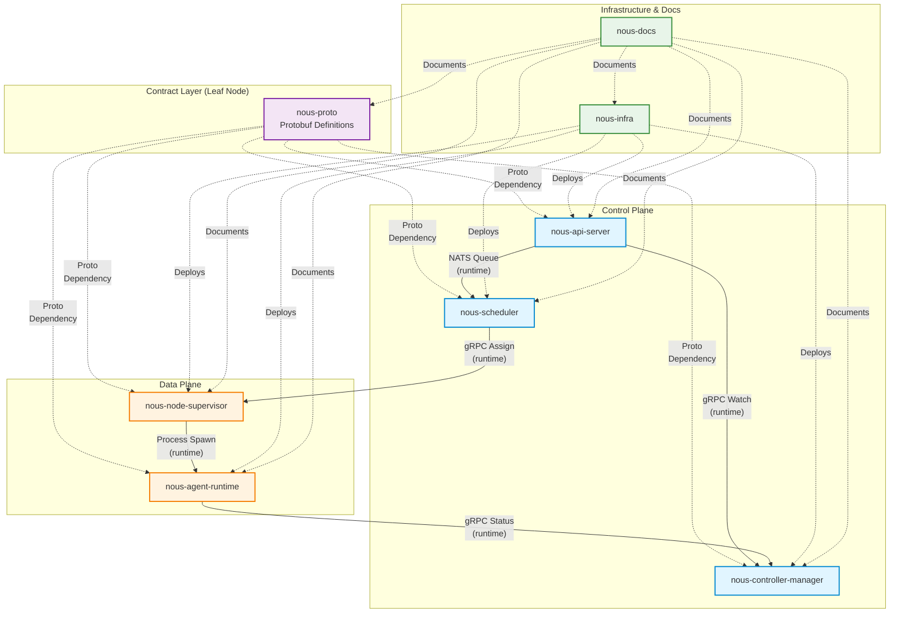

# Inter-Repository Dependency Graph

## Overview

This document maps inter-repository relationships in the Nous platform. All repositories follow a strict DAG (Directed Acyclic Graph) pattern with no circular dependencies.

**Critical Rule**: Runtime communication (gRPC, NATS) between services is NOT a Go module dependency. All services communicate via proto-defined contracts. Services generate proto stubs locally — they do NOT import each other as Go module dependencies.

---

## Dependency DAG



---

## Dependency Types

### 1. Protobuf Contract Dependency (Compile-Time)
**Pattern**: Service depends on proto definitions for type definitions and gRPC service interfaces.

**Implementation**: Services use `buf generate` to create local Go stubs from proto files.

**Direction**: `nous-proto` (leaf node) ← all services

**Evidence**: All services have `buf.gen.yaml` pointing to `nous-proto`

**Example**:
```yaml
# nous-api-server/buf.gen.yaml
version: v2
plugins:
  - remote: buf.build/protocolbuffers/go
    out: gen
    opt: paths=source_relative
```

---

### 2. Runtime Communication (NOT a Module Dependency)
**Pattern**: Services communicate via gRPC/NATS at runtime, but do NOT import each other's Go modules.

**Implementation**: Both services depend on shared proto definitions, not each other.

**Critical Rule**: `go.mod` must NEVER list another service repo as a dependency.

**Valid**:
```go
// nous-api-server imports proto-generated types
import v1alpha1 "github.com/nousproj/nous-proto/gen/nous/v1alpha1"
```

**INVALID**:
```go
// ❌ NEVER DO THIS — service importing another service
import "github.com/nousproj/nous-scheduler/internal/scheduler"
```

---

### 3. Deployment Dependency
**Pattern**: Infrastructure repository contains deployment configuration for services.

**Direction**: `nous-infra` → all services (Pulumi stacks, Docker Compose, Helm charts)

**Evidence**: `nous-infra/stacks/control-plane/` references service container images

---

### 4. Documentation Dependency
**Pattern**: Documentation repository documents all components.

**Direction**: `nous-docs` → all repos (documentation, no runtime dependency)

---

## Dependency Matrix

| From Repo | To Repo | Dependency Type | Evidence | Prohibited? |
|-----------|---------|-----------------|----------|-------------|
| `nous-api-server` | `nous-proto` | Proto (compile-time) | `buf.gen.yaml` | ✅ Allowed |
| `nous-scheduler` | `nous-proto` | Proto (compile-time) | `buf.gen.yaml` | ✅ Allowed |
| `nous-controller-manager` | `nous-proto` | Proto (compile-time) | `buf.gen.yaml` | ✅ Allowed |
| `nous-node-supervisor` | `nous-proto` | Proto (compile-time) | `buf.gen.yaml` | ✅ Allowed |
| `nous-agent-runtime` | `nous-proto` | Proto (compile-time) | `buf.gen.yaml` | ✅ Allowed |
| `nous-controller-manager` | `nous-api-server` | Runtime (gRPC Watch) | CLAUDE.md | ✅ Allowed (runtime only) |
| `nous-scheduler` | `nous-api-server` | Runtime (NATS Queue) | CLAUDE.md | ✅ Allowed (runtime only) |
| `nous-scheduler` | `nous-node-supervisor` | Runtime (gRPC Assign) | CLAUDE.md | ✅ Allowed (runtime only) |
| `nous-node-supervisor` | `nous-agent-runtime` | Runtime (Process Spawn) | CLAUDE.md | ✅ Allowed (runtime only) |
| `nous-agent-runtime` | `nous-controller-manager` | Runtime (gRPC Status) | CLAUDE.md | ✅ Allowed (runtime only) |
| `nous-api-server` | `nous-scheduler` | ❌ Go module import | N/A | ❌ PROHIBITED |
| `nous-scheduler` | `nous-api-server` | ❌ Go module import | N/A | ❌ PROHIBITED |

**Legend**:
- ✅ Allowed — Compliant with DAG rules
- ❌ PROHIBITED — Would create circular dependency or violate architecture

---

## Key Rules

### Rule 1: Proto is a Leaf Node
`nous-proto` has ZERO outbound dependencies. It is the foundation — all services depend on it, but it depends on nothing.

**Validation**:
```bash
cd nousproj/nous-proto
grep -c "^require" go.mod || echo "No dependencies (correct)"
```

---

### Rule 2: Services Never Import Each Other's Go Modules
Services communicate via proto-defined contracts. Runtime communication (gRPC, NATS) ≠ Go module dependency.

**Validation**:
```bash
cd nousproj/nous-api-server
go mod graph | grep github.com/nousproj/nous-scheduler && echo "VIOLATION DETECTED" || echo "OK"
```

Expected: `OK` (no nous-scheduler import)

---

### Rule 3: Deployment is One-Way
`nous-infra` deploys services, but services do NOT import from `nous-infra`.

**Validation**:
```bash
cd nousproj/nous-api-server
go list -m all | grep nous-infra && echo "VIOLATION" || echo "OK"
```

---

### Rule 4: Use `go work` for Local Development
During development, use `go.work` at the parent directory level to enable cross-repo imports without `replace` directives.

**Setup**:
```bash
cd nousproj
go work init
go work use ./nous-proto ./nous-api-server ./nous-controller-manager ./nous-scheduler ./nous-node-supervisor ./nous-agent-runtime
```

**Important**: Add `go.work` and `go.work.sum` to `.gitignore` in each repo. Never commit workspace files.

---

## Proto Consumption Pattern

### Central Definitions, Local Generation

**Pattern**: `nous-proto` holds source `.proto` files. Services generate stubs locally using `buf generate`.

**Why**: Avoids versioning hell, ensures all services can evolve proto stubs independently.

**Example Workflow**:
```bash
# In nous-proto
buf generate

# In nous-api-server
buf generate https://github.com/nousproj/nous-proto.git#tag=v0.1.0
```

**Evidence**: `repository_standards.md:63-90`

---

## Validation Commands

### Check for Inter-Repo Go Module Cycles
```bash
#!/bin/bash
for repo in nous-api-server nous-scheduler nous-controller-manager nous-node-supervisor nous-agent-runtime; do
  echo "Checking $repo..."
  cd nousproj/$repo
  go mod graph | grep "github.com/nousproj/nous-" | grep -v "nous-proto" && echo "VIOLATION in $repo" || echo "$repo OK"
  cd ../..
done
```

Expected: All repos show `OK` (only `nous-proto` is allowed)

---

### Check for Package Import Cycles Within a Repo
```bash
cd nousproj/nous-api-server
go list -deps ./... | xargs go list -f '{{ .ImportPath }} {{ .Deps }}'
```

If cycles exist, `go list` will error. No output = no cycles.

---

### Verify Proto Dependency Only
```bash
cd nousproj/nous-scheduler
go list -m all | grep github.com/nousproj
```

Expected output:
```
github.com/nousproj/nous-proto v0.1.0
```

Only `nous-proto` should appear.

---

## Cycle Prevention Strategy

### Problem: Why Cycles are Prohibited
- **Build failures**: Go compiler rejects circular imports
- **Testing complexity**: Cannot test components in isolation
- **Deployment coupling**: Services cannot be deployed independently
- **Reasoning difficulty**: Hard to understand data flow

### Solution: Strict DAG with Proto Contracts
- Proto definitions are the **contract layer** (leaf node)
- Services implement **either client or server**, not both simultaneously
- Runtime communication uses **generated stubs**, not direct imports

**Example**:
```
User → API Server (server) → gRPC → Scheduler (client of proto)
                              ↓
                           Scheduler (server) → gRPC → Node Supervisor (client of proto)
```

Both API Server and Scheduler implement different parts of the proto, but neither imports the other's Go module.

---

## Anti-Patterns to Avoid

### ❌ DO NOT: Import Another Service's Internal Package
```go
// WRONG — violates dependency rules
import "github.com/nousproj/nous-scheduler/internal/scheduler"
```

### ❌ DO NOT: Use Replace Directives in Committed go.mod
```go
// WRONG — will break in CI
replace github.com/nousproj/nous-proto => ../nous-proto
```

Use `go work` instead for local development.

### ❌ DO NOT: Create Shared Utility Libraries Across Services
Duplicate small utilities if needed. Extract shared code to `nous-proto` only when patterns stabilize.

---

## References

- 
- [ADR-003](../adr/003-proto-based-contracts.md) — Proto-based contracts decision
- [cycle-analysis.md](../analysis/cycle-analysis.md) — Cycle detection forensics
