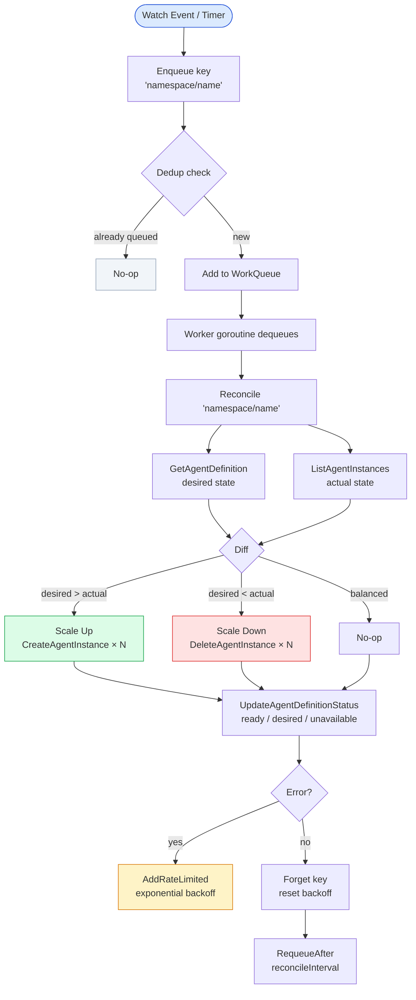
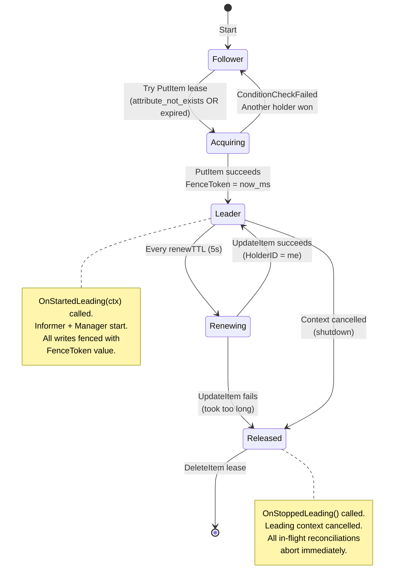
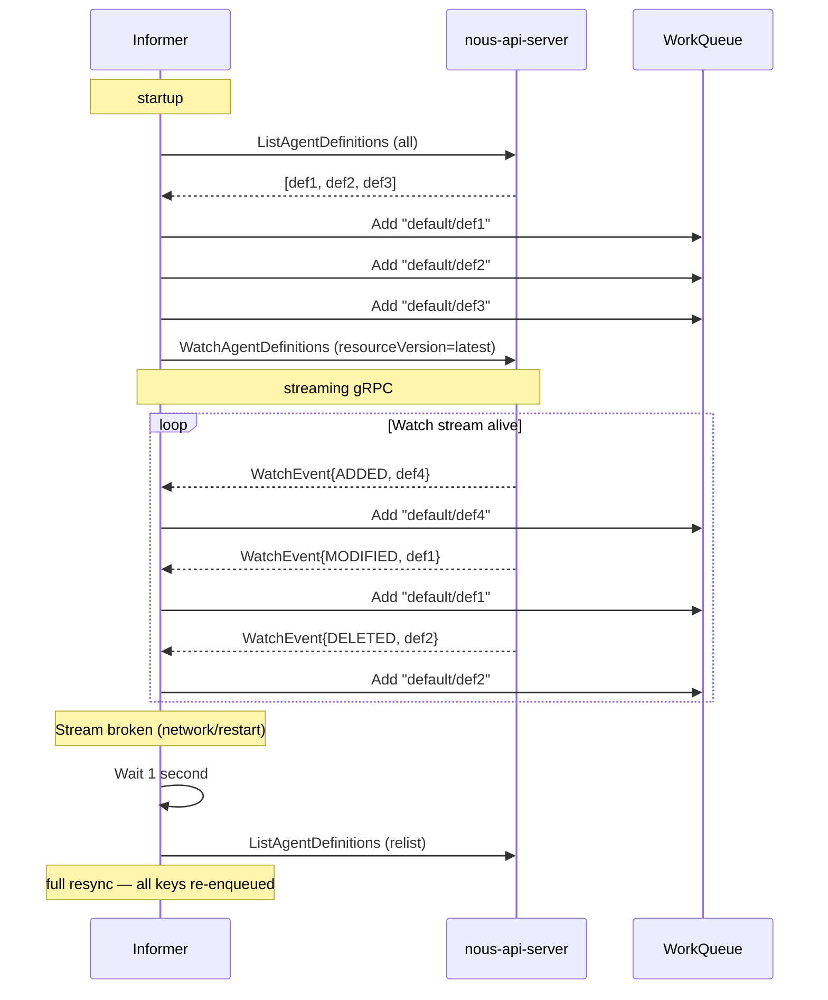

# Reconciliation Loop

The reconciliation loop is the heart of Nous. It is the implementation of the **observe → diff → act** pattern that Kubernetes pioneered — applied to AI agent management.

## The Core Pattern



---

## Work Queue Design

The work queue is modeled after `client-go/util/workqueue`. Key properties:

### Deduplication

```go
// Add("default/researcher") three times → only one entry in queue
q.Add("default/researcher")
q.Add("default/researcher")  // no-op — already queued
q.Add("default/researcher")  // no-op — already queued
```

### Processing Set

When a key is being processed, it moves from the queue to the processing set. New Add() calls mark the key as "dirty":

```
State transitions:
  add("k") → queue: [k], dirty: {}, processing: {}
  get("k")  → queue: [],  dirty: {}, processing: {k}
  add("k")  → queue: [],  dirty: {k}, processing: {k}  ← marked dirty
  done("k") → queue: [k], dirty: {},  processing: {}   ← re-enqueued
```

### Exponential Backoff

Failed reconciliations get exponential backoff so transient errors don't hammer the API server:

| Attempt | Delay |
|---------|-------|
| 1st failure | 5ms |
| 2nd failure | 10ms |
| 3rd failure | 20ms |
| ... | doubles each time |
| max | 1000s |

After a successful reconciliation, the key is `Forget()`ed and backoff resets to base.

---

## Leader Election

Only one controller-manager replica is active at a time. Leader election uses DynamoDB conditional writes.



### Fencing Token

The FenceToken is a `UnixMilli` timestamp set at lease acquisition. Every write to DynamoDB includes a condition `FenceToken <= :acquired_token`. If a stale leader (replica with an old token) attempts a write after a new leader has taken over with a higher token, the write is rejected with `ErrStaleFence`.

**Implementation**: The controller-manager's gRPC client attaches the current fence token as the `x-nous-fence-token` metadata header on every outgoing call. The api-server's `UnaryFenceTokenInterceptor` reads this header and wraps the `StateStore` with `WithFenceToken(token)` for the duration of that request. Service methods transparently pick up the fenced store via `storeFor(ctx)`.

---

## Informer: List + Watch

The informer seeds the work queue on startup and keeps it updated via the gRPC Watch stream:



---

## AgentController.Reconcile in Detail

```go
func (c *AgentController) Reconcile(ctx context.Context, key string) (Result, error) {
    // 1. Parse key
    namespace, name := splitKey(key)

    // 2. Fetch desired state
    def, err := c.client.GetAgentDefinition(ctx, namespace, name)
    if isNotFound(err) {
        return Result{}, nil  // deleted — nothing to do
    }

    // 3. Fetch actual state
    instances, err := c.client.ListAgentInstances(ctx, namespace, name)

    // 4. Compute diff
    desired := int(def.Spec.Scaling.DesiredInstances)
    if desired == 0 { desired = 1 }  // default
    actual := len(instances)

    // 5. Act
    switch {
    case actual < desired:
        // Scale up: create (desired - actual) new instances
        for i := 0; i < desired-actual; i++ {
            inst := buildAgentInstance(def, generateShortID())
            c.client.CreateAgentInstance(ctx, inst)
        }
    case actual > desired:
        // Scale down: delete (actual - desired) oldest instances
        for i := 0; i < actual-desired; i++ {
            c.client.DeleteAgentInstance(ctx, instances[i])
        }
    }

    // 6. Update status
    status := computeStatus(def, instances)
    c.client.UpdateAgentDefinition(ctx, withStatus(def, status))

    // 7. Requeue for periodic health check
    return Result{RequeueAfter: c.reconcileInterval}, nil
}
```

!!! note "Phase 1 Gap"
    `CreateAgentInstance` and `DeleteAgentInstance` RPCs are not yet defined in `nous-proto`. The current implementation logs intent but cannot execute scale-up/down. These RPCs will be added in Phase 2.
