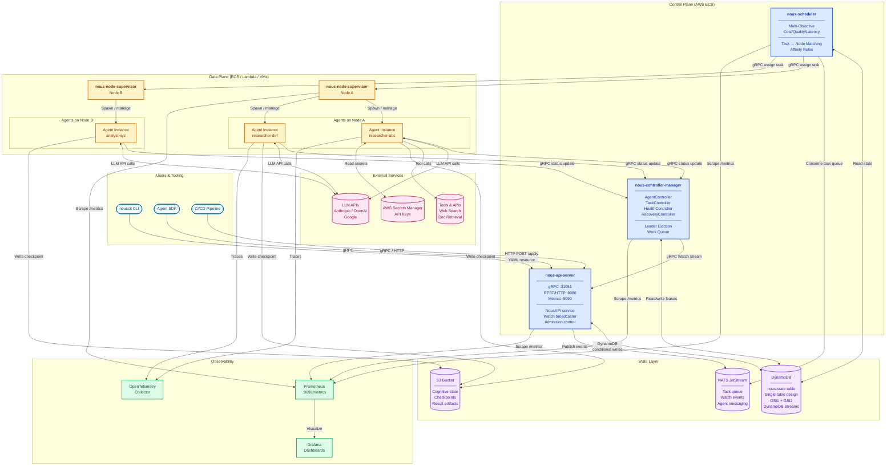
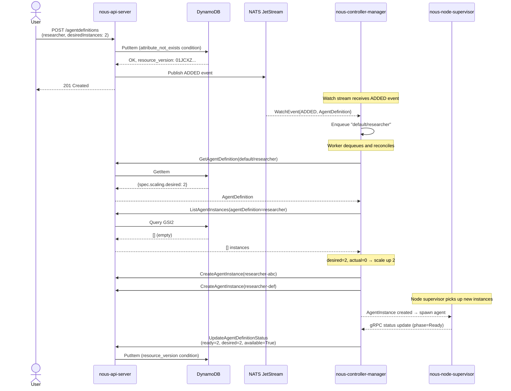
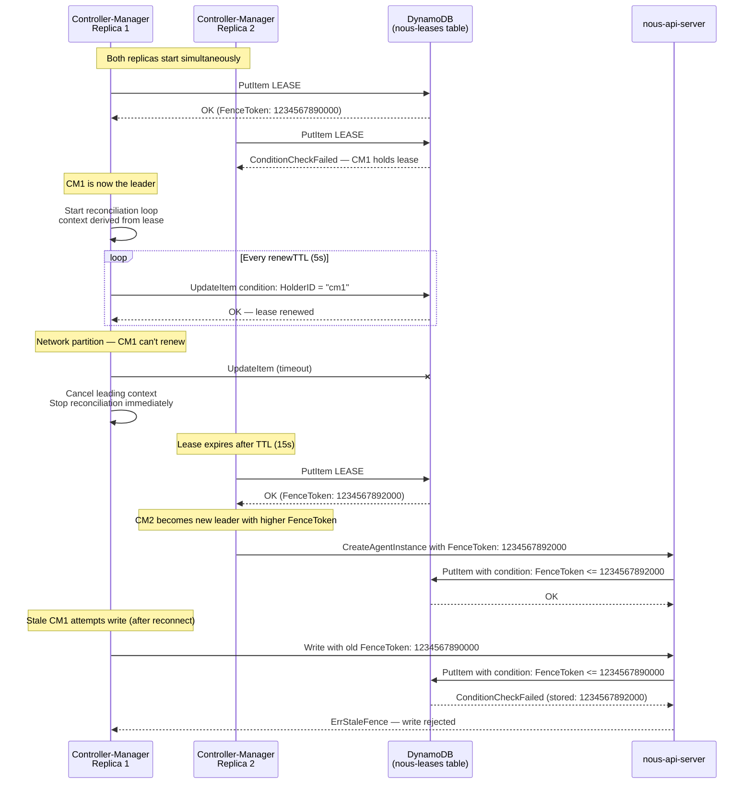
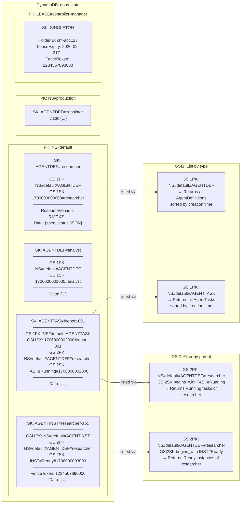
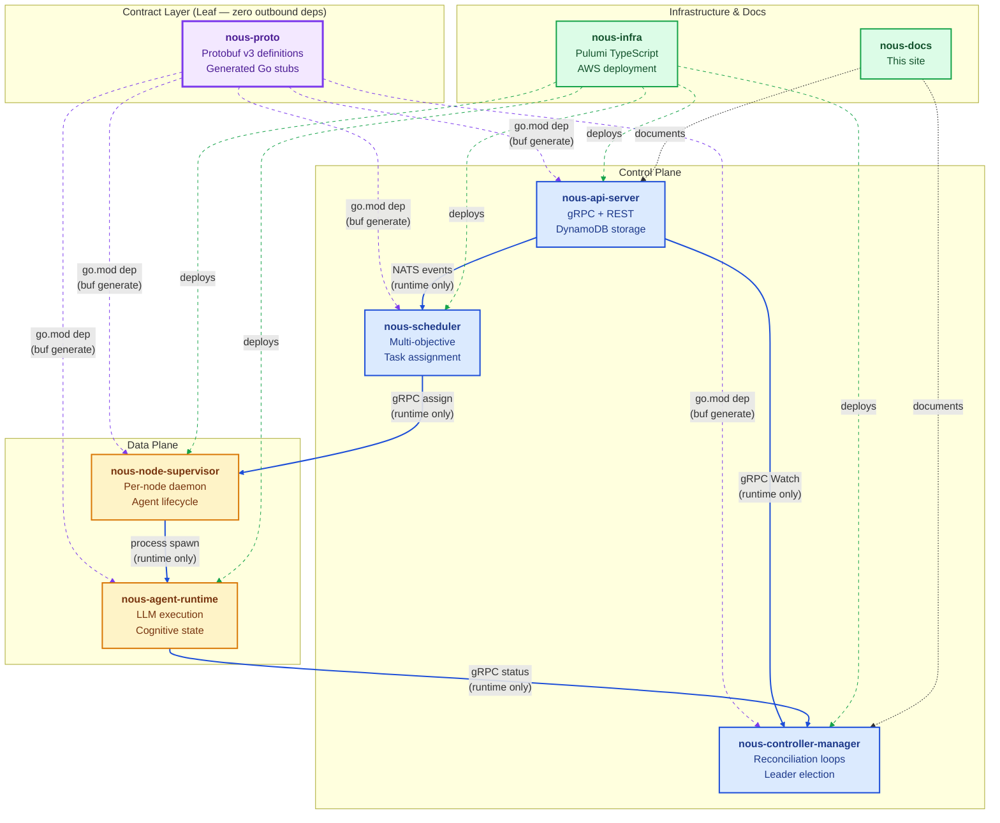
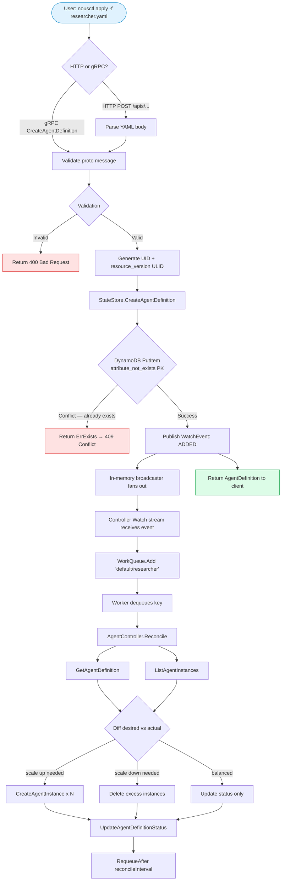
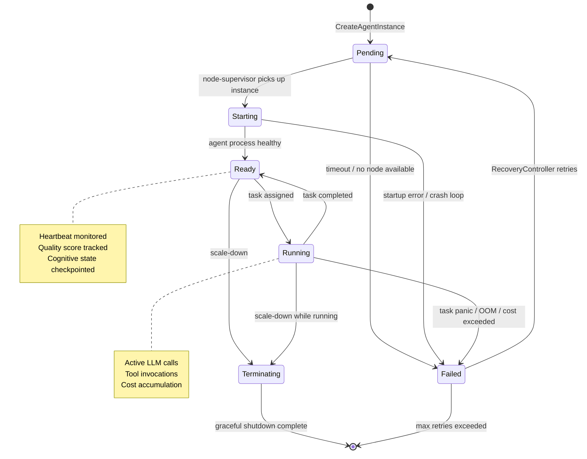
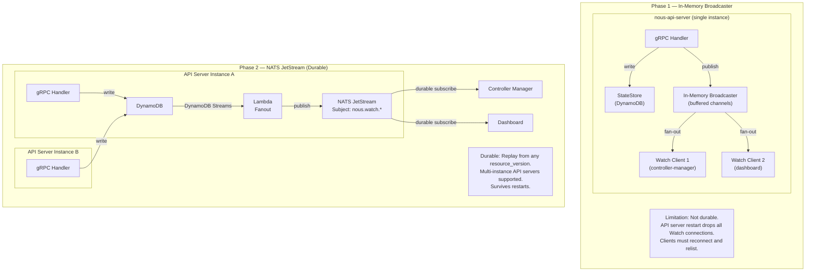

# Visual Architecture

This page provides comprehensive visual diagrams of the Nous architecture — covering the full system topology, data flows, component interactions, and the DynamoDB storage model.

---

## Full System Topology

The complete Nous platform showing all components, layers, and their interactions:

---

## Reconciliation Loop

The core control loop — how the system self-heals:

---

## Leader Election & Fencing

How split-brain is prevented across multiple controller-manager replicas:

---

## DynamoDB Single-Table Design

The storage layout — one table, multiple resource types:

---

## Component Dependency DAG

How the repositories relate to each other — compile-time vs runtime:

!!! warning "Critical Rule"
    Dashed arrows = compile-time Go module dependency
    Solid arrows = runtime-only gRPC/NATS communication
    **No service ever imports another service's Go module.** Proto contracts are the only shared code.

---

## Request Flow: nousctl apply

End-to-end request flow for `nousctl apply -f researcher.yaml`:

---

## State Machine: AgentInstance Phases

How an agent instance transitions through its lifecycle:

---

## Watch API: Phase 1 vs Phase 2

How the Watch API evolves from single-instance to distributed:

