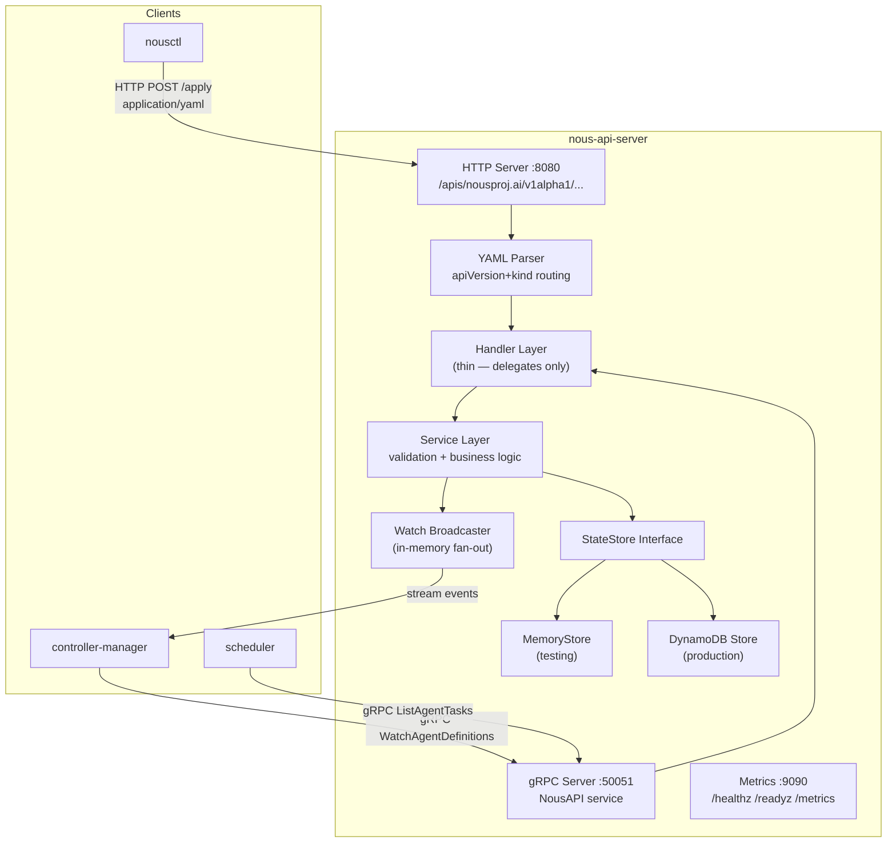

# nous-api-server

The user-facing entry point for the Nous platform. Implements the `NousAPI` gRPC service and a REST/HTTP endpoint for YAML resources.

## Responsibilities

- **gRPC server** — implements all `NousAPI` service methods (CRUD + Watch)
- **HTTP/REST server** — accepts `application/yaml` or `application/json` bodies with K8s-style URL patterns
- **StateStore** — stores all resources in DynamoDB (or in-memory for testing)
- **Watch broadcaster** — fans out change events to all connected Watch subscribers
- **Admission control** — validates resource specs before storage
- **Observability** — `/healthz`, `/readyz`, `/metrics` endpoints

## Architecture



## Key Endpoints

### gRPC (`:50051`)

| Method | Description |
|--------|-------------|
| `CreateAgentDefinition` | Create a new agent definition |
| `GetAgentDefinition` | Get by namespace + name |
| `ListAgentDefinitions` | List with label selector + pagination |
| `UpdateAgentDefinition` | Optimistic-lock update |
| `DeleteAgentDefinition` | Delete by namespace + name |
| `CreateAgentTask` | Submit a new task |
| `GetAgentTask` | Get task by namespace + name |
| `ListAgentTasks` | List with phase/agentDef filters |
| `CancelAgentTask` | Cancel a running task |
| `WatchAgentDefinitions` | Server-streaming Watch |
| `WatchAgentTasks` | Server-streaming Watch |
| `WatchAgentInstances` | Server-streaming Watch |
| `GetAgentInstance` | Get instance (controller-managed) |
| `ListAgentInstances` | List instances by definition |
| `UpdateAgentInstanceStatus` | Controller updates instance status |

### HTTP/REST (`:8080`)

| Method | Path | Description |
|--------|------|-------------|
| `POST` | `/apis/nousproj.ai/v1alpha1/namespaces/{ns}/agentdefinitions` | Create |
| `GET` | `/apis/nousproj.ai/v1alpha1/namespaces/{ns}/agentdefinitions` | List |
| `GET` | `/apis/nousproj.ai/v1alpha1/namespaces/{ns}/agentdefinitions/{name}` | Get |
| `PUT` | `/apis/nousproj.ai/v1alpha1/namespaces/{ns}/agentdefinitions/{name}` | Update |
| `DELETE` | `/apis/nousproj.ai/v1alpha1/namespaces/{ns}/agentdefinitions/{name}` | Delete |

Same pattern for `agenttasks` and `agentinstances`.

## DynamoDB Storage

Uses a single-table design. See [Data Model](../architecture/data-model.md) for full schema.

### Key operations

**Create** (optimistic — fails if exists):
```go
PutItem with condition: attribute_not_exists(PK)
// → ErrExists if item already present
```

**Update** (optimistic lock — fails on version mismatch):
```go
PutItem with condition: ResourceVersion = :expected
// → ErrConflict if version changed since read
```

**Delete** (fails if already gone):
```go
DeleteItem with condition: attribute_exists(PK)
// → ErrNotFound if item missing
```

## Optimistic Concurrency

Every resource has a `resource_version` ULID. Update operations must provide the current version. If another writer updated the resource since your read, the conditional write fails with `ErrConflict` — the client must re-read and retry.

```
Client A reads:   resource_version = "01JCXZ..."
Client B updates: resource_version bumped to "01JCXZ+1..."
Client A updates: FAILS — "01JCXZ..." no longer matches stored version
Client A retries: re-reads, sees new version, applies patch, succeeds
```

## Configuration

| Env Var | Default | Description |
|---------|---------|-------------|
| `NOUS_SERVER_GRPC_PORT` | `50051` | gRPC listen port |
| `NOUS_SERVER_HTTP_PORT` | `8080` | HTTP/REST listen port |
| `NOUS_SERVER_METRICS_PORT` | `9090` | Metrics/health port |
| `NOUS_STORAGE_DRIVER` | `memory` | `memory` or `dynamodb` |
| `NOUS_STORAGE_DYNAMODB_TABLE` | `nous-state` | DynamoDB table name |
| `NOUS_STORAGE_DYNAMODB_REGION` | `us-west-2` | AWS region |
| `NOUS_STORAGE_DYNAMODB_ENDPOINT` | `` | Override for DynamoDB Local |
| `NOUS_LOG_LEVEL` | `info` | `debug`, `info`, `warn`, `error` |
| `NOUS_LOG_FORMAT` | `json` | `json` or `text` |

## Running Locally

```bash
# In-memory mode (no AWS required)
make run

# With DynamoDB Local
make docker-up   # Start DynamoDB Local container
make run-local   # Start server pointing at localhost:8000
```

## Fencing Token Interceptor

The gRPC server includes a server-side `UnaryFenceTokenInterceptor` that reads the `x-nous-fence-token` metadata header sent by the controller-manager. When present, the interceptor wraps the base `StateStore` with `WithFenceToken(token)` and stores the fenced store in the request context.

Service methods call `storeFor(ctx)` to retrieve the appropriate store for each request:

```go
// Returns the fenced store if the controller sent a token,
// otherwise returns the plain store (for nousctl, REST, etc.)
func (s *AgentDefinitionService) storeFor(ctx context.Context) storage.AgentDefinitionStore {
    if cs := storage.StoreFromContext(ctx); cs != nil {
        return cs
    }
    return s.store
}
```

This ensures that writes from a stale leader are automatically rejected by DynamoDB with `ErrStaleFence` → `codes.FailedPrecondition` (HTTP 412).

## Phase 1 Status

- [x] gRPC server — all NousAPI methods
- [x] HTTP/REST server — YAML apply/get/delete
- [x] In-memory StateStore (tests)
- [x] DynamoDB StateStore (production)
- [x] Watch broadcaster (in-memory fan-out)
- [x] Optimistic concurrency (resource_version)
- [x] Fencing token interceptor (`x-nous-fence-token` metadata)
- [x] `/healthz`, `/readyz`, `/metrics`
- [x] Unit tests (27 DynamoDB, handler tests)
- [x] Integration tests (DynamoDB Local)
- [ ] Admission webhooks
