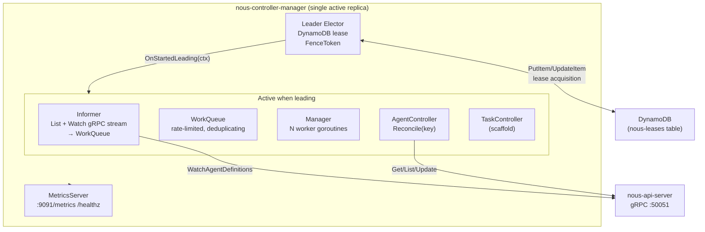

# nous-controller-manager

The reconciliation engine of the Nous control plane. Watches `AgentDefinition` resources via the API server's gRPC Watch stream and ensures the correct number of `AgentInstance`s exist.

> "The brain that translates desired state into actual state."

## Architecture



## Components

### Leader Election

Uses DynamoDB conditional writes to ensure only one replica is active:

- **Acquire**: `PutItem` with condition `attribute_not_exists OR LeaseExpiry < now OR HolderID = me`
- **Renew**: `UpdateItem` every 5s with condition `HolderID = me`
- **FenceToken**: `UnixMilli()` at acquisition time — prevents stale-leader writes
- **TTL**: 15s — if holder crashes, lease expires and another replica takes over

For dev/testing, use `NoopLeaderElector` which immediately grants leadership without DynamoDB.

### Informer

Maintains a live view of `AgentDefinition` resources:

1. On start: `ListAgentDefinitions` → seed work queue with all keys
2. Then: open `WatchAgentDefinitions` gRPC stream
3. On `ADDED`/`MODIFIED`/`DELETED` events: enqueue the key
4. On stream failure: 1s delay → relist → rewatch

### Work Queue

Rate-limited, deduplicating queue (modeled after `client-go/util/workqueue`):

| Feature | Behavior |
|---------|----------|
| Deduplication | Same key queued multiple times → processed once |
| Processing set | Key in-flight → re-adds mark it dirty, re-enqueued on `Done()` |
| Rate limiting | Failed keys: exponential backoff (5ms → 1000s) |
| Shutdown | Drain in-flight work, unblock all `Get()` calls |
| `AddAfter` | Delayed enqueue for `RequeueAfter` results |

### AgentController

Core reconciliation logic — see [Reconciliation Loop](../architecture/reconciliation-loop.md) for full detail.

```
Reconcile("default/researcher"):
  1. GetAgentDefinition → desired: {scaling.desired: 2}
  2. ListAgentInstances(agentDef=researcher) → actual: []
  3. Diff: need 2 more instances
  4. CreateAgentInstance × 2   ← TODO: needs proto RPC
  5. UpdateAgentDefinitionStatus: {ready:0, desired:2, available:False}
  6. RequeueAfter: 30s
```

## Configuration

| Env Var | Default | Description |
|---------|---------|-------------|
| `NOUS_APISERVER_ADDRESS` | `localhost:50051` | gRPC address of nous-api-server |
| `NOUS_LEADERELECTION_ENABLED` | `false` | Enable DynamoDB leader election |
| `NOUS_LEADERELECTION_DYNAMODB_TABLENAME` | `nous-leases` | Leases table name |
| `NOUS_LEADERELECTION_DYNAMODB_ENDPOINT` | `` | Override for DynamoDB Local |
| `NOUS_CONTROLLER_WORKERS` | `2` | Number of worker goroutines |
| `NOUS_CONTROLLER_RECONCILEINTERVAL` | `30s` | Periodic re-reconciliation interval |
| `NOUS_METRICS_PORT` | `9091` | Metrics server port |
| `NOUS_LOG_LEVEL` | `info` | Log level |

## Running Locally

```bash
# Without leader election (single replica dev)
make run

# With DynamoDB Local leader election
make docker-up    # in nous-api-server — start DynamoDB Local
make run-local    # start with NOUS_LEADERELECTION_ENABLED=true
```

## Metrics

| Metric | Type | Description |
|--------|------|-------------|
| `nous_reconcile_duration_seconds` | Histogram | Time per reconciliation |
| `nous_reconcile_total` | Counter | Total reconciliations by controller + result |
| `nous_queue_depth` | Gauge | Current work queue depth |
| `nous_agent_instances_total` | Gauge | Instances by definition/namespace/category |
| `nous_leader_status` | Gauge | 1 if this replica is the leader, 0 otherwise |

## Fencing Token Passthrough

Every gRPC call from the controller-manager to the api-server carries the current **fencing token** as metadata. This prevents a split-brain scenario where a stale leader continues writing after another replica has acquired the lease.

### How it works

```
controller-manager                          api-server
      │                                          │
      │  grpc call + x-nous-fence-token: 42      │
      │ ───────────────────────────────────────▶ │
      │                                          │ UnaryFenceTokenInterceptor
      │                                          │   reads token=42 from metadata
      │                                          │   wraps store with WithFenceToken(42)
      │                                          │   stores fenced store in ctx
      │                                          │
      │                                          │ Handler → Service → store.Create...
      │                                          │   DynamoDB: condition FenceToken <= 42
      │                                          │   if stored FenceToken > 42 → ErrStaleFence
      │                                          │   → gRPC codes.FailedPrecondition
      │ ◀─────────────────────────────────────── │
```

### Components

**client-side** (`internal/client/interceptor.go`):

```go
// Reads token from leader elector before each call.
// If token == 0 (not leader / noop), header is omitted.
func fenceTokenInterceptor(provider FenceTokenProvider) grpc.UnaryClientInterceptor
```

**server-side** (`internal/middleware/fencing.go` in api-server):

```go
// Reads x-nous-fence-token from gRPC metadata.
// Wraps the base store with WithFenceToken(token).
// Stores the fenced store in context via storage.ContextWithStore.
func UnaryFenceTokenInterceptor(baseStore storage.StateStore, logger *slog.Logger) grpc.UnaryServerInterceptor
```

Service methods call `storeFor(ctx)` which returns the fenced store when present, falling back to the base store for unauthenticated callers (nousctl, REST clients).

### FenceToken value

- `DynamoDBLeaderElector`: `UnixMilli()` at acquisition time
- `NoopLeaderElector`: always returns `0` → no header attached → no fencing (correct for single-replica dev)

## Phase 1 Status

- [x] AgentController watches via gRPC Watch stream
- [x] Reconciliation creates/deletes AgentInstances to match desired count
- [x] Status updates (ready/desired/unavailable/conditions)
- [x] Leader election (DynamoDB + Noop)
- [x] Rate-limited work queue with exponential backoff
- [x] Fencing token gRPC metadata interceptor
- [x] Prometheus metrics server
- [x] Structured logging with controller name + resource key
- [x] Unit tests (14 passing)
- [x] Dockerfile + Makefile
- [ ] Periodic resync timer
